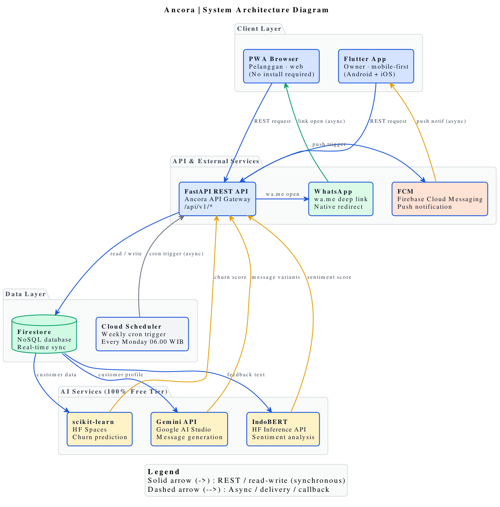

# Ancora Churn Detection AI — System Architecture

This document describes the high-level architecture of **Ancora**, an AI-powered customer retention platform for Indonesian MSMEs.

## Overview Diagram

## System Components

Ancora is built on a modern, decoupled architecture designed to support lightweight and low-cost execution suitable for MSMEs.

### 1. Frontend Layer
- **Flutter App (Owner Dashboard)**: A cross-platform mobile app used by business owners to view weekly churn alerts, generate marketing messages, and manage bookings.
- **Customer Booking PWA**: A progressive web application that allows customers to make bookings without having to install a full app.

### 2. Backend Layer (FastAPI)
FastAPI serves as the core orchestration engine, providing high-performance asynchronous REST endpoints:
- **`POST /api/v1/sentiment`**: Uses **Gemini 1.5 Flash** to perform sentiment analysis on customer feedback and automatically categorize it.
- **`POST /api/v1/messages/generate`**: Uses **Gemini 1.5 Flash** to construct personalized, context-aware WhatsApp retention messages.
- **`POST /api/v1/jobs/churn-detection`**: Internal batch endpoint triggered by **Cloud Scheduler** to re-calculate Heartbeat Scores for all customers.

### 3. Machine Learning Pipeline
- **XGBoost Churn Classifier**: Predicts the likelihood of customer churn (Heartbeat Score).
- **RFM+ Feature Engineering**: Features are extracted based on Recency, Frequency, Monetary value, Service Diversity, and Trend.
- **SMOTE Resampling**: Balances the transaction history datasets during training (85% active / 15% churn).

### 4. Database Layer (Google Firestore)
A real-time, NoSQL cloud database storing:
- `customers`: Customer profiles and contact info.
- `transactions`: Customer transactional history.
- `heartbeat_scores`: Real-time and batch-calculated retention scores.
- `bookings`: Appointment details.
